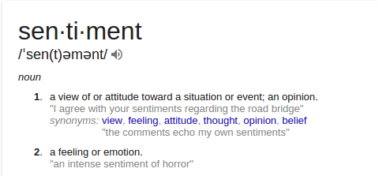
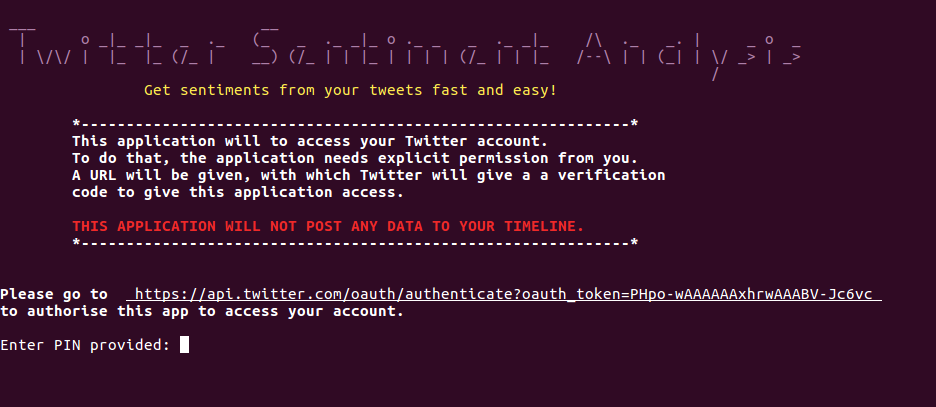

# Twitter Sentiment Analysis

## Introduction



This a console application that helps you get a glimpse of sentiments that can deduced from your twitter status updates.

The application grabs your status updates, checks the frequency of important words in the tweets and also uses the IBM Alchemy API to deduce sentiments.

### Sentiments

Google dictionary defines 'sentiment' as 
> a view of or attitude toward a situation or event; an opinion.
> a feeling or emotion.

The scope to of this application is constrained to doing two things:
* Deducing emotions expressed in the tweets. By emotions, I mean feeling such as anger, fear, joy and so on. Ordinarily, one expects a mixture of emotions to be expressed. Thus, you will be presented by a list of five different emotions with a percentage score for each.
* Overall sentiment -- whether your tweets express positive view, negative view or neutral view. Again, a percentage score for each sentiment is also displayed.

NOTE: This analysis is done using artificial intelligence by the awesome folks at [IBM Alchemy API](http://www.alchemyapi.com/). 
**THE RESULTS DISPLAYED BY THIS APPLICATION SHOULD NEVER BE USED AS A BASIS FOR ANY PERSONAL OR BUSINESS DECISIONS; ANY SENTIMENTS DISPLAYED ARE PURELY FOR ENTERTAINMENT VALUE AND PROGRAMMING PLEASURE.**

## Installation and Setup

**Twitter Sentiment Analysis currently works in Python 3 only. It will be ported to Python
 2 soon, so please, bear with it for now.**

To get up and running:
* Clone this repo using the url:

    ```https://github.com/michaelkamau/bc-10-Twitter-Sentiment-Analysis```

* Navigate to the Twitter Sentiment Analysis folder and install dependencies:

    ```pip install -r requirements```

    NOTE: For operating systems where Python 3 is not default, you might have to to do this:
    
    ```pip3 install -r requirements```

* To run the application:
    
    ```python3 main.py```

    If Python3 is default in your setup:
    
    ```python main.py```

_THAT'S it._

You will be greeted by this screen 



## Why am I doing this?

This project is part of the Andela boot-camp set of activities, which am currently participating in.

Feel free to comment on the code or ask any questions about the boot-camp.
